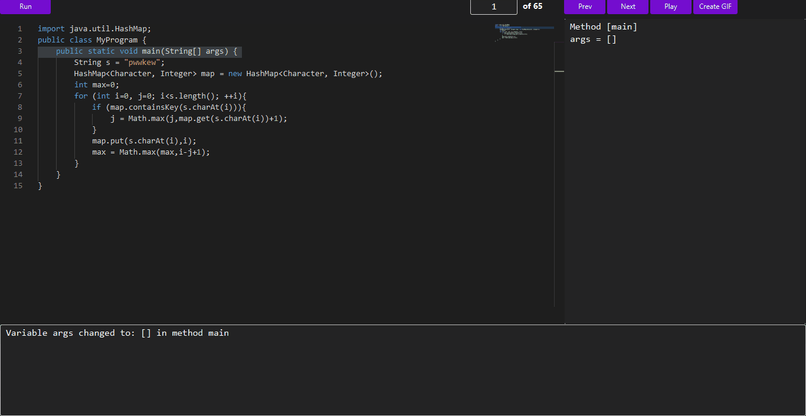

# Java Code Execution Visualizer

**A Java Desktop Application to Visualize Java Code Execution**

This project is a Java desktop application that allows users to input Java code, execute it, and visualize its execution. The application shows variable changes, method calls, and provides an interactive way to step through the code execution. Additionally, it can generate GIFs of the code's execution to help visualize the flow.

This tool is useful for who want to understand Java code execution or debug code step-by-step.



## Features

- **Code Execution Visualization**: Visualize variable changes, method calls, and control flow as the code executes.
- **Interactive Step Through**: Step through the code one instruction at a time, both forwards and backwards, to understand how the code is running.
- **GIF Generation**: Generate a GIF of the execution to share or use for reference.
- **Code Editor**: Write and modify Java code directly in the input area.

## Tech Stack

- **Java 11+**: The application is compatible with Java 11 and later. Personally, I had no issues running it with Java 21 (Zulu).
- **JavaFX**: Used for building the graphical user interface (GUI).
- **Maven**

## Dependencies

- **ASM**: Used for bytecode manipulation to capture variable changes.
- **Java Parser**: Used for analyzing Java code to capture method calls.
- **MonacoFX**: Integrated Monaco Editor for a rich code editing experience.
- **Animated GIF Library**: Used to generate GIFs of the execution flow (com.madgag:animated-gif-lib:1.4).

## Getting Started

### Installation

1. Clone the repository:

    ```bash
    git clone https://github.com/hugoruiz00/java-visualizer.git
    ```

2. Navigate to the project directory:

    ```bash
    cd java-visualizer
    ```

3. Run the application:

    - You can run the application using VsCode or your IDE (like IntelliJ, NetBeans or Eclipse).

### Usage

1. In the code input field, type or paste any Java code you want to visualize.
2. Click the **Run** button to execute the code.
3. Use the **Next** and **Prev** buttons to navigate through the execution step-by-step. Visualize variable changes, method calls, and control flow.
4. Click the **Play** button to automatically step through the execution without manual action.
5. To generate a GIF of the execution, click the **Create GIF** button, wait for the process to complete, and then choose the location where you'd like to save it via the modal that appears.

### How it works

#### 1. User Input & Compilation

- The user writes Java code in the editor.
- The code is saved as a `.java` file and compiled.

#### 2. Code Instrumentation

##### Method Calls & Return Statements:
- The code is analyzed using **JavaParser**, which injects logs for method calls and return statements.
- Method calls related to collections (e.g., `add`, `remove`) are also logged but displayed as variable changes in the UI for simplicity.

##### Variable Changes:
- The compiled `.class` file is processed with **ASM** to capture variable changes, injecting additional logs.

These modifications ensure the execution logs contain all key events for visualization (these 'logs' are just `System.out.println` statements).

#### 3. Execution & Log Capture

- The modified `.class` file runs, generating structured logs in the following format:
    ```json
    {
    "key": "f1750f0e-e59b-416e-b9d6-8618b5c2dba8",
    "lineNumber": 4,
    "type": "variableChange",
    "name": "myVar",
    "value": "pwwkew"
    }
    ```
- These logs capture step-by-step changes in variable values and method executions.

#### 4. Data Transformation for Visualization

- The log data is converted into a structured **Java object format**, representing each step of execution as a **code state**:
    ```json
        [
            {
                "method": "main",
                "lineNumber": 4,
                "changeDescription": "Variable s changed to: pwwkew in method main",
                "variables": {
                "main-args": {
                    "name": "args",
                    "value": "[]",
                    "method": "main"
                },
                "main-s": {
                    "name": "s",
                    "value": "pwwkew",
                    "method": "main"
                }
                }
            }
        ]
    ```

- Each code state includes:
  - The method where execution occurred.
  - The line number executed.
  - A description of the change.
  - A list of variable states up to that point.

#### 5. Visualization & Interaction

- The processed execution states are displayed in the UI.
- Users can **step forward** (`Next`) or **step backward** (`Prev`) through the execution.
- The **Play** button automates stepping through the execution.
- Users can generate a **GIF** of the execution and save it.

## License

This project is licensed under the MIT License - see the [LICENSE](LICENSE) file for details.

